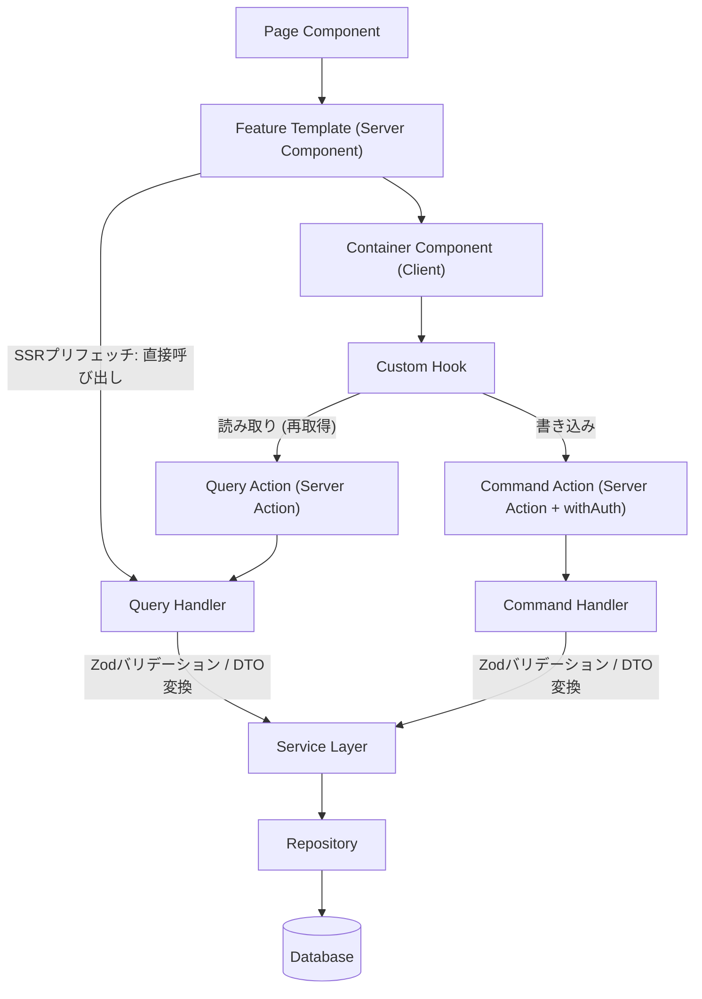

# アーキテクチャ設計

## 全体構成

```
frontend/src/
├─ app/          # App Router (薄く保つ)
├─ features/     # 機能別モジュール
├─ shared/       # 共通コンポーネント・ユーティリティ
└─ external/     # 外部連携層 (API・DB)
```

## 設計原則

1. **関心の分離**: 各層の責任を明確に定義
2. **Server Components優先**: クライアントサイドのJSを最小化
3. **型安全性**: TypeScriptとZodによる完全な型保証
4. **テスタビリティ**: 各層を独立してテスト可能に
5. **変更可用性**: バックエンド技術の変更に対する柔軟性を確保

## レイヤーの責務

### App Router (`/app`)
- ルーティング定義
- メタデータ設定
- 認証チェック
- エラーハンドリング

### Features (`/features`)
- ビジネスロジック
- UI実装
- 状態管理
- カスタムフック

### Shared (`/shared`)
- 共通コンポーネント
- ユーティリティ関数
- 型定義
- プロバイダー

### External (`/external`)
- データアクセス（現在）/ API連携（将来）
- ビジネスロジック実装
- データ変換（DTO）
- 変更可用性の確保

`external`はさらに`domain`（ドメインロジック）・`handler`（Query/Command Handler・Action）・`service`・`repository`・`dto`・`client`に分かれる。各層の実装方針は[05_external_layer.md](./05_external_layer.md)で定める。

## データフロー



## 認証アーキテクチャ

- Better Authによるセッション管理（Google OAuthのみ）。APIハンドラは`src/app/api/auth/[...all]/route.ts`のcatch-allルート
- ルートグループによるルート保護（`middleware.ts`は未使用）
  - `(authenticated)`グループ: protected layoutがguard functionを呼び、未認証なら`/login`にリダイレクト
  - `(guest)`グループ: protected layoutがguard functionを呼び、認証済みなら`/notes`にリダイレクト
- Server Component側のセッション検証: `getSessionServer()`（better-authの`auth.api.getSession`をラップ）をServer Component/Server関数内で直接呼び出す
- Server Action / Handler層での認可: Command系Actionは`withAuth()`でセッションを検証し、`accountId`をHandlerに渡す。未認証時は`/login`にリダイレクトする
